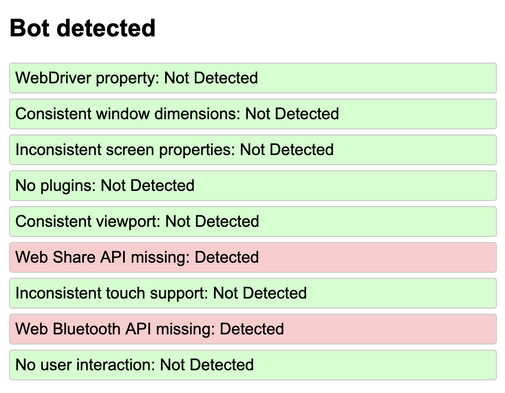

# BotSpotter

BotSpotter is a project designed to detect automated browser interactions (bots) using various JavaScript techniques. This repository contains the bot detection JS script and instructions on how to test it using different automation tools.

## Bot Detection Techniques and Browser Results

| Technique | Explanation | Brave 1.70.119 | Safari 18.1 | Chrome 129.0.6668.71 | Edge 129.0.2792.65 | Firefox 130.0.1 | Puppeteer | Selenium | PlayWright |
|-----------|-------------|----------------|-------------|----------------------|--------------------|-----------------|-----------|----------|------------|
| WebDriver property | Checks if the `navigator.webdriver` property is set, which is often true for automated browsers. | Not Detected | Not Detected | Not Detected | Not Detected | Not Detected | Detected | Detected | Detected
| Consistent window dimensions | Verifies if the outer and inner window dimensions are identical, which is often the case in headless browsers. | Not Detected | Not Detected | Not Detected | Not Detected | Not Detected | Not Detected | Not Detected | Detected
| No plugins | Checks if the browser has no plugins, which is common in automated browsers. | Not Detected | Not Detected | Not Detected | Not Detected | Not Detected | Not Detected | Not Detected | Detected
| Consistent viewport | Verifies if the viewport dimensions match the screen dimensions, which can indicate a headless environment. | Not Detected | Not Detected | Not Detected | Not Detected | Not Detected | Not Detected | Not Detected | Detected
| Web Share API missing | Checks if the Web Share API is absent, which might be the case in some automated environments. | Not Detected | Not Detected | Not Detected | Not Detected | Detected | Detected | Not Detected | Detected
| Inconsistent screen properties | Verifies if available screen dimensions match total screen dimensions, which might be inconsistent in some automated environments. | Not Detected | Not Detected | Not Detected | Not Detected | Not Detected | Detected | Not Detected | Detected
| Inconsistent touch support | Checks for inconsistencies in touch support properties, which might occur in some automated browsers. | Detected | Not Detected | Detected | Detected | Not Detected | Detected | Detected | Detected
| Web Bluetooth API missing | Verifies if the Web Bluetooth API is absent, which might be the case in some automated environments. | Not Detected | Detected | Not Detected | Not Detected | Detected | Not Detected | Not Detected | Not Detected |
| No user interaction | Monitors for common user interactions like mouse movement, clicks, key presses, or scrolling. | Not Detected | Not Detected | Not Detected | Not Detected | Not Detected | Detected | Detected | Detected

## Analysis

1. Most modern browsers pass the majority of these detection methods, showing how sophisticated they've become in mimicking "normal" browser behavior.

2. The "Inconsistent touch support" method flags Brave, Chrome, and Edge as potential bots, suggesting this method might produce false positives for these Chromium-based browsers.

3. Firefox is the only regular browser that lacks the Web Share API among the tested browsers, which could potentially lead to false positives if this method is weighted too heavily.

4. Safari and Firefox both lack the Web Bluetooth API, again highlighting the need for caution when using this as a bot detection method.

5. The WebDriver property detection is highly effective for identifying Puppeteer and Selenium, but doesn't trigger for any of the regular browsers. This makes it a strong indicator of automation when present.

6. Puppeteer and Selenium both triggered the "No user interaction" check, which is expected for automated tools and demonstrates the value of this method for detecting scripts that don't simulate user interactions. This is absolutely should not be used in real life scenario, since if actual human is not active right after entering the webpage, it may produce false detection

7. Puppeteer triggered more detection methods than Selenium, including "Web Share API missing" and "Inconsistent screen properties". This suggests that Puppeteer might be easier to detect with this set of methods.

8. Neither Puppeteer nor Selenium triggered the "Automation-specific properties" or "Selenium-specific properties" checks. This might indicate that these tools have evolved to hide these telltale signs, or that our implementation of these checks needs refinement.

9. The "Consistent screen dimensions" and "Consistent viewport" checks didn't trigger for any browser or tool, suggesting these methods might need adjustment to be more effective.

Key Takeaways:

1. A combination of methods is crucial for accurate bot detection. No single method is foolproof.
2. The WebDriver property and lack of user interaction are strong indicators of automation tools like Puppeteer and Selenium.
3. Some methods (like inconsistent touch support) may produce false positives with certain browsers and should be weighted carefully.
4. Regular browsers are becoming increasingly sophisticated in their feature sets, making some traditional bot detection methods less reliable.
5. Automation tools are evolving to better mimic regular browsers, necessitating more advanced and nuanced detection techniques.
6. Continuous updating and refinement of detection methods is necessary to keep up with evolving browsers and automation tools.

This analysis underscores the complexity of bot detection and the need for a carefully calibrated, multi-faceted approach to minimize false positives while effectively identifying automated browsers.

## TODO
1. improve detections for Selenium using $cdc_ variable: https://stackoverflow.com/questions/33225947/can-a-website-detect-when-you-are-using-selenium-with-chromedriver  
2. add modern detections: https://github.com/rebrowser/rebrowser-bot-detector?tab=readme-ov-file#sourceurlleak
3. add detections for other automation providers

## Contributing

Contributions to BotSpotter are welcome! Please feel free to submit a Pull Request.

## License

This project is licensed under the MIT License - see the [LICENSE](LICENSE) file for details.
